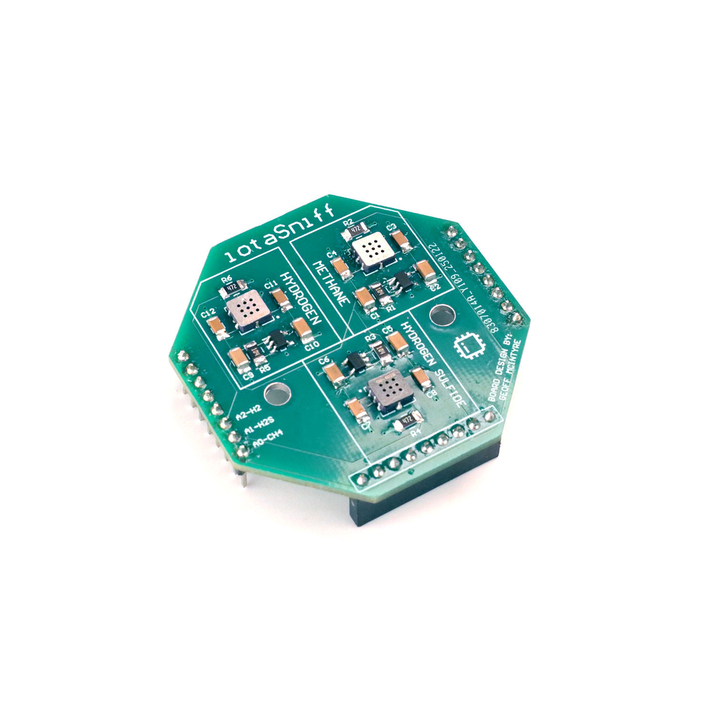

# tinySniff — Gas Sensor HAT for tinyCore

**A Gas/Air Quality (MEMS) sensor board for the [tinyCore](https://github.com/Mister-Industries/tinyCore) ESP32-S3 platform.**

Measures Methane, Hydrogen, and Hydrogen Sulfide. Great for air-quality and environmental monitoring projects.

[Purchase](https://mr.industries) · [Discord](https://discord.gg/hvJZhwfQsF) · [Documentation](https://tinydocs.cc/3_tiny-hats/tinysniff/)

---

## Pinout

tinySniff uses the following tinyCore GPIO pins. These are active whenever the HAT is mounted, so avoid assigning them to other peripherals in your own sketches.

### MEMS Sensor Pinouts

| Signal | GPIO | Description |
|--------|------|-------------|
| H2 | A2 | GM-2021B (Hydrogen) Sensor |
| H2S | A1 | GM-602B (Hydrogen Sulfide) Sensor |
| CH4 | A0 | GM-402B (Combustible Gas / Methane) Sensor |

### How to open the Schematic (Altium)
The tinySniff design files are provided as an Altium Designer project. Altium Designer is a professional electronic design automation (EDA) software package.

To open the files:
1. Open [Altium Designer](https://www.altium.com/altium-designer) (requires a commercial license or the free Altium Viewer. Free student licenses are available).
2. Click **File > Open Project...** 
3. Navigate to the Hardware folder of this repository and select the `.PrjPcb` project file.
4. Once the project loads in the Projects panel, you can access:
   - **Schematic Editor** - Double-click the `.SchDoc` file to view the circuit design.
   - **PCB Editor** - Double-click the `.PcbDoc` file to view the board layout.

The project will open with all associated files (schematic, PCB, and libraries) ready to view and edit.
